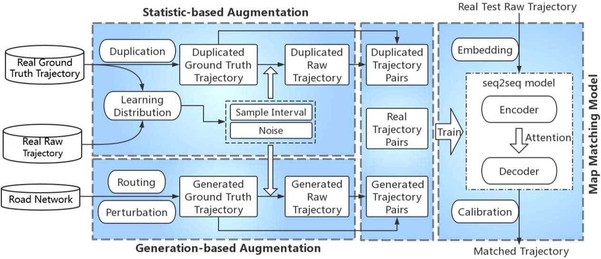

# DeepMM
Codes for DeepMM: Deep learning based map matching with data augmentation, journal version in TMC 2020 and short paper in SIGSPATIAL 2019

# Introduction
As a fundamental component in map service, map matching is of great importance for many trajectory-based applications, e.g., route optimization, traffic scheduling, and fleet management. In practice, Hidden Markov Model and its variants are widely used to provide accurate and efficient map matching service. However, HMM-based methods fail to utilize the knowledge (e.g., the mobility
pattern) of enormous trajectory big data, which are useful for intelligent map matching. Furthermore, with many following-up works, they are still easily influenced by the common noisy and sparse records in the reality. In this paper, we revisit the map matching task from the data perspective and propose to utilize the great power of massive data and deep learning to solve these problems. Based on the seq2seq learning framework, we build a trajectory2road model with attention mechanism to map the sparse and noisy trajectory into the accurate road network. Different from previous algorithms, our deep learning based model complete the map matching in the latent space, which provides the high tolerance to the noisy trajectory and also enhances the matching with the knowledge of mobility pattern. Extensive experiments demonstrate that the proposed model outperforms the widely used HMM-based methods by more than 10 percent (absolute accuracy) in various situations especially the noisy and sparse settings.



# Codes
- TraceGen/GraphHopperMainGen.java: generate trajectory with shortest path plus perturbation, used with [Graphhooper](https://github.com/graphhopper/graphhopper)
- DeepMM/: main codes for DeepMM
    - configs: config file for various experiments
    - seq2seq.py: main file for running experiments
    - run**.sh: scripts for running experiments
    - model.py: model definition of DeepMM
- preprocess/: codes for trajectory filtering, downsampling, and adding noise
- postprocess/: codes for trajectory calibration, metric calculation, plot figures
- baselines/, fmm_matching.py: codes for FMM and ST-Matching, based on implementation from https://github.com/cyang-kth/fmm
    - FMM: Fast map matching, an algorithm integrating hidden Markov model with precomputation, International Journal of Geographical Information Science 2018
    - ST-Matching: Map-matching for low-sampling-rate GPS trajectories, SIGSPATIAL 2009

# Citation
If you find this repo helpful, please cite our paper.
```latex
@article{feng2020deepmm,
  title={DeepMM: Deep learning based map matching with data augmentation},
  author={Feng, Jie and Li, Yong and Zhao, Kai and Xu, Zhao and Xia, Tong and Zhang, Jinglin and Jin, Depeng},
  journal={IEEE Transactions on Mobile Computing},
  volume={21},
  number={7},
  pages={2372--2384},
  year={2020},
  publisher={IEEE}
}

@inproceedings{zhao2019deepmm,
  title={DeepMM: Deep learning based map matching with data augmentation},
  author={Zhao, Kai and Feng, Jie and Xu, Zhao and Xia, Tong and Chen, Lin and Sun, Funing and Guo, Diansheng and Jin, Depeng and Li, Yong},
  booktitle={Proceedings of the 27th ACM SIGSPATIAL international conference on advances in geographic information systems},
  pages={452--455},
  year={2019}
}
```
# Acknowledgement
We appreciate the following GitHub repos a lot for their valuable code and efforts.
- https://github.com/cyang-kth/fmm
- https://github.com/graphhopper/graphhopper
